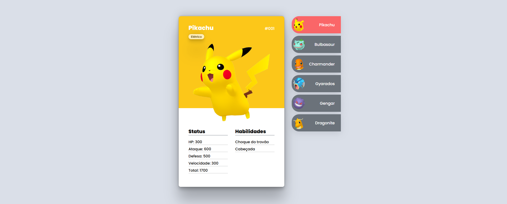

<!-- Projeto Finalizado -->
# ✨ Desafio DEV: Pokédex
<p align="center">
  <!-- Contador de linguagens do GitHub -->
  
  <!-- Tamanho do repositório no GitHub -->
  
  <!-- Licença do GitHub -->
  
</p>

<p align="center">
  
</p>

## 🌟 Funcionalidades
- Exibição de cartões de Pokémon com detalhes como tipo, status e habilidades.
- Navegação interativa entre diferentes Pokémon através de uma lista lateral.
- Design responsivo para uma melhor experiência em dispositivos móveis.

## 🌐 Visualize o Projeto
Você pode visualizar o projeto online através deste [link](https://devandreotti.github.io/pokedex/).

## ⚙️ Tecnologias Utilizadas
- **HTML**: Estruturação do conteúdo da página.
- **CSS**: Estilização e layout responsivo.
- **JavaScript**: Funcionalidade interativa e manipulação do DOM.

## 🚀 Rodando o Projeto
1. Clone o repositório
   ```bash
   git clone https://github.com/devAndreotti/pokedex.git
   ```
2. Abra o arquivo `index.html` no navegador.

## 🛠️ Estrutura do Projeto
```
├── src/                           # Diretório principal do projeto
│   ├── css/                       # Folhas de estilo CSS
│   │   ├── reset.css              # Reset de estilos padrão
│   │   ├── global.css             # Estilos globais
│   │   ├── cartao.css             # Estilos para os cartões de Pokémon
│   │   ├── listagem.css           # Estilos para a listagem de Pokémon
│   │   └── responsivo.css         # Estilos responsivos
│   ├── Imagens/                   # Imagens dos Pokémon e outros recursos visuais
│   └── js/                        # Scripts JavaScript
│       └── index.js               # Script principal para funcionalidade interativa
├── index.html                     # Página principal do projeto
└── README.md                      # Documentação do projeto
```

## 💪 Como Contribuir
1. Faça um **fork** do projeto.
2. Crie uma nova branch com suas alterações: `git checkout -b minha-alteracao`.
3. Salve as alterações e faça um commit: `git commit -m "feat: minha nova funcionalidade"`.
4. Envie as alterações: `git push origin minha-alteracao`.
5. Abra um Pull Request para revisão.

## 📄 Nota
Este projeto é para fins educacionais e demonstra a criação de uma interface de usuário interativa usando HTML, CSS e JavaScript. Sinta-se livre para explorar, modificar e adaptar conforme necessário.
